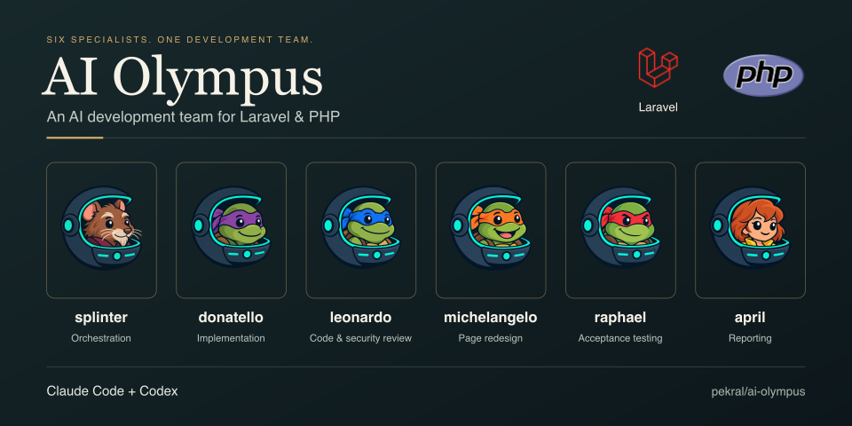

<p align="center">
  
</p>

# AI Olympus — An AI Development Team for Laravel

<p align="center">
  <a href="https://packagist.org/packages/pekral/ai-olympus"></a>
  <a href="https://packagist.org/packages/pekral/ai-olympus"></a>
  <a href="https://packagist.org/packages/pekral/ai-olympus"></a>
  <a href="https://github.com/pekral/ai-olympus/actions/workflows/pr.yml"></a>
  <a href="https://github.com/pekral/ai-olympus/blob/master/LICENSE"></a>
  <a href="https://pekral.cz"></a>
</p>

**AI Olympus** gives a Laravel/PHP team an **AI development team inside Claude Code** — five specialized subagents that resolve GitHub issues, open pull requests, review code, audit security, write Pest tests, and report the result back to the tracker. One `composer require --dev` installs the whole roster together with the coding-standard rules and agent skills they run on. It replaces the hand-maintained `CLAUDE.md` and the ad-hoc prompt library every project otherwise reinvents.

## Quickstart

```bash
composer require pekral/ai-olympus --dev
vendor/bin/ai-olympus install --force
```

No Composer in the project? Add it as a Claude Code plugin instead — see [Installation](#installation).

Then point the front-door agent at real work, inside Claude Code:

```text
@daedalus resolve https://github.com/owner/repo/issues/123
```

`daedalus` picks the route, `hephaestus` implements it, `athena` reviews it to convergence, and you get a pull request back.

## What You Get

| Layer      | What it is                                                            | Installed into   |
|------------|-----------------------------------------------------------------------|------------------|
| **Rules**  | Long-lived project standards Claude Code applies to every edit        | `.claude/rules`  |
| **Skills** | Reusable workflows, from `resolve-issue` to `security-review`         | `.claude/skills` |
| **Agents** | Orchestration roles that combine skills into an issue-to-PR pipeline  | `.claude/agents` |

## Why This Package

- **Ship an issue without writing the boilerplate** — one agent takes the ticket, implements it, and hands back a reviewed pull request
- **Reviews that block on real findings** — one review pass covers quality and security together and must reach zero Critical and Moderate before anything merges
- **Tests you did not have to remember to write** — a change lands with Pest coverage for the lines it touched
- **One standard across every repository** — the same PHP/Laravel rules travel with the package instead of being copy-pasted per project
- **54 comprehensive Agent skills** you can invoke directly when you want the workflow without the agent
- **Onboarding measured in one command** — a fresh checkout gets the whole team from `composer require --dev`

## Installation

There are two ways in. **Composer** is the complete one and stays the recommendation for a PHP project. The **plugin marketplace** exists for everyone else — most of this package is stack-agnostic, and a project without Composer had no way to reach it at all.

| | Composer | Plugin marketplace |
|---|---|---|
| Requires | PHP + Composer | Claude Code only |
| Skills, agents | ✅ installed into `.claude/` | ✅ loaded from the plugin |
| Rules, `CLAUDE.md` | ✅ installed into the project | ⚠️ one extra command — see below |
| `--deny-network-bash` and the other opt-in switches | ✅ | ❌ Composer only |
| Unattended runs (`ai-olympus resolve-next`) | ✅ | ❌ Composer only |

### Via the plugin marketplace (no Composer)

```text
/plugin marketplace add pekral/ai-olympus
/plugin install ai-olympus@ai-olympus
```

That loads all 54 skills and the five agents. It does **not** load the rules: Claude Code reads neither `rules/` nor a `CLAUDE.md` out of a plugin directory, so one command copies them into the project once.

```text
/ai-olympus:install-rules
```

It writes `.claude/rules/` and, when the project has none, a `CLAUDE.md` — it never overwrites one you already have. Restart the session afterwards; rules are read at session start.

The opt-in security switches stay bound to the Composer installer. A plugin install writes nothing to `.claude/settings.local.json`.

### Via Composer

The [Quickstart](#quickstart) above carries the two commands. This is what they put in your project — the installer targets **Claude Code only**:

- `.claude/rules` and `.claude/skills` in the project
- `.claude/agents` (the five subagents)
- `CLAUDE.md` in the project root

Skills install into the project only. Claude Code lets a personal skill (`~/.claude/skills`) override a project one, so a home copy would shadow this checkout in every project on the machine — `--global` opts into that deliberately, and `--prune-global` clears copies an earlier version left behind. See [Where skills are installed](docs/installation.md#where-skills-are-installed).

> [!IMPORTANT]
> By default, the installer only copies missing files and keeps existing content untouched. Use the `--force` flag to overwrite existing files: `vendor/bin/ai-olympus install --force`. This is particularly useful when you want to update rules to their latest versions or when you've made local changes that should be replaced. The file `CLAUDE.md` is never overwritten once it exists in the target project, so you can safely customize it.

Everything beyond those two commands — enabling auto-install on `composer install`, the full command list, the installer flow, and every CLI switch — lives in [`docs/installation.md`](docs/installation.md).

---

## Claude Code Subagents

Agents are a thin orchestration layer over the existing skills — they don't replace them and they don't duplicate their prompts. The roster is named after **Greek mythology** by function (see [`docs/agents.md`](docs/agents.md)).

```text
Rules  = long-lived project standards
Skills = reusable workflows
Agents = specialised orchestration roles over multiple skills
```

Each agent has its own avatar under [`assets/agents/`](assets/agents). Full role definitions live in [`docs/agents.md`](docs/agents.md).

<table>
<tr>
<td width="96" valign="top"></td>
<td valign="top">

**`hephaestus` — code-writing implementer**

Implements an issue from context or a tracker link, authors its test coverage, runs the tests covering the change, then opens a PR. Also runs as the fast scoped validation gate after a landing step. Stops at the PR — it never reviews its own work, merges, or publishes to a tracker.

**Orchestrates:** `resolve-issue`, `create-test`, `create-missing-tests-in-pr`, `e2e-testing`

</td>
</tr>
<tr>
<td width="96" valign="top"></td>
<td valign="top">

**`argus` — acceptance tester** · read-only

The only agent that **runs the application**. It starts a local instance and tests it like a real tester — the API through a real HTTP client, the UI in a real browser (the project's own automation, or the bundled `browser-drive.sh` runner that needs nothing installed in the project) — then returns a per-criterion Met / Not met / Blocked verdict with the exact request/response or clicks it performed. A UI criterion it cannot drive in a browser is `Blocked`, never satisfied by calling the endpoint behind the page. Dispatched only when the change alters observable behaviour — a refactor or a docs change is skipped — and the browser starts only when the diff actually touched a UI surface, so an API-only task is still exercised over HTTP without paying for a browser run. Its input is the running system, which is where a missing migration or an unstarted queue worker hides from both the diff and a green test suite. It never edits code, authors tests, merges, or publishes.

**Orchestrates:** `tester-cookbook`, `e2e-testing`

</td>
</tr>
<tr>
<td width="96" valign="top"></td>
<td valign="top">

**`daedalus` — engineering-workflow orchestrator** · the front door

The entry point for a free-form request. Resolves a concrete source, then dispatches `athena` (security-risk analysis, on demand), `hephaestus` (implementation, then scoped validation), `athena` (the single CR pass) and `hermes` (the post-convergence report) through the Task tool, planning a dependency-aware resolve order. Delegates every engineering step — never implements or reviews itself. It also owns the **backlog tier** and runs it inline: triage over the open issues, and splitting a subject too broad for one PR into deliverable issues, after which the run ends there.

**Orchestrates:** `hephaestus`, `athena`, `hermes` (dispatched) · `github-issue-triage`, `create-issues-from-text`, `create-issue` (inline)

</td>
</tr>
<tr>
<td width="96" valign="top"></td>
<td valign="top">

**`athena` — the code-review sentinel** · read-only

The roster's **only** CR agent. Two modes: the authoritative code review after `hephaestus` — code quality, architecture, optimisation **and** security in one pass, one published review, driven to convergence — and an on-demand pre-implementation security analysis that feeds a remediation plan to `hephaestus`. Applies every security rule and labels each finding Critical / Moderate / Minor.

**Orchestrates:** `code-review-github`, `code-review-jira`, `code-review-bugsnag`, `process-code-review`, `security-review`, `laravel-authorization-review`, `laravel-security`, `security-bounty-hunter`, `security-threat-analysis`, `analyze-problem`

</td>
</tr>
<tr>
<td width="96" valign="top"></td>
<td valign="top">

**`hermes` — release announcer & reporter** · read-only

The roster's only publishing agent — anything that reaches a tracker audience routes through it. Turns a merged change or release into announcement content: a Twitter/X tweet (≤280 chars) + thread, release notes, and a marketing summary with pekral.cz promotion. It also publishes the post-convergence report (what changed + how to test) on the source tracker at the end of a `daedalus` run, composed from the shared brief and `hephaestus`'s validation handoff.

**Orchestrates:** `resolve-issue/references/source-detection`, `pr-summary`

</td>
</tr>
</table>

### How to use `athena` in practice

1. Install for Claude Code:

   ```bash
   vendor/bin/ai-olympus install
   ```

   Agents land in `.claude/agents/`.

2. Invoke it with a **source** — a GitHub PR/issue, a JIRA key, a Bugsnag error, or just the current branch/PR:

   ```text
   @athena review PR #123
   @athena review https://your.atlassian.net/browse/PROJ-42
   @athena review the current diff
   ```

3. `athena` detects the tracker, runs the matching `code-review-*` skill (which drives the full CR skill set), adds the security skills that wrapper does not run, lets it **post one consolidated review to the PR**, then returns a handoff: `CR done` + PR link + source link + Critical/Moderate/Minor counts + assignment-conformance verdict.

`athena` is **read-only** — it never applies fixes, commits, pushes, or merges. Those belong to separate agents.

### How to use `hephaestus` in practice

1. Install for Claude Code, exactly as for `athena` — agents land in `.claude/agents/`.

2. Invoke it with a **source** — a GitHub issue/PR, a JIRA key, a Bugsnag error, or just the task you want implemented:

   ```text
   @hephaestus implement #123
   @hephaestus implement https://your.atlassian.net/browse/PROJ-42
   @hephaestus implement the failing upload validation
   ```

3. `hephaestus` detects the source, runs `resolve-issue` to implement the change, runs the tests covering it, then opens a PR and returns a handoff: `Impl done` + PR link + source link + branch + a summary of what changed and the local-checks result.

`hephaestus` **stops at the PR** — it never reviews its own work or merges. The whole code review — quality, architecture, optimisation and security — belongs to `athena`. Hand the PR to `athena` for review next.

> [!NOTE]
> **If `hephaestus` reports `Blocked: sandbox denied file write`:** dispatched subagents run non-interactively, so a write is denied unless the path is pre-allowed. Add scoped `Edit` / `Write` entries for the project tree to `permissions.allow` in `.claude/settings.local.json` (`"Edit(//Users/me/Projects/my-app/**)"`, `"Write(//Users/me/Projects/my-app/**)"`) — or run the installer with `--allow-subagent-writes` to add them for you — then re-run. See [`docs/agents.md`](docs/agents.md) *Troubleshooting — subagent file writes blocked*. The run correctly stops instead of silently finishing the work in the main thread.

### How to use `daedalus` in practice

`daedalus` is the **front door** — the agent you address with a free-form request when you don't want to pick a specialist yourself.

1. Install for Claude Code, exactly as for the other agents.

2. Invoke it with a request — it resolves the source and chooses the route:

   ```text
   @daedalus resolve a random Resolve_by_AI issue
   @daedalus resolve https://github.com/owner/repo/issues/123
   @daedalus implement a dark-mode toggle for the settings page
   ```

3. `daedalus` resolves a concrete source, then **dispatches the matching specialist agent through the Task tool**: a security-focused task → `athena` (security-risk analysis → remediation plan) → `hephaestus`; everything else → `hephaestus` directly; then `athena` for the review-and-fix loop to convergence. A subject too broad for one PR is not pushed into a single PR: `daedalus` splits it into deliverable issues itself, inline, and the run ends there, so you re-run it per issue. A pure backlog request (*"triage the open issues"*, *"what should we work on next"*) is answered the same way — inline, no PR. It returns a handoff naming the chosen route and reason, written in the same language as your request.

   Ask explicitly for **savings mode** (*"run this in savings/token-efficient mode"*, *"úsporný režim"*) to opt into a token-efficient variant of the exact same pipeline — same agents, same convergence gate, same PR/review/feedback artifacts, just less duplicate context re-derivation and fewer repeated build runs. It is off by default; see [`docs/agents.md`](docs/agents.md) *Savings mode* for how it works.

`daedalus` is a **read-only orchestrator** — it never analyses, implements, or reviews itself; it delegates every step by dispatching the matching specialist agent, and (per the one-level subagent-nesting rule) it runs as the top-level agent you talk to, spending that single nesting level on the dispatch rather than being a nested subagent itself. It owns the backlog tier too — deciding what is worked on and in what order — and runs that part **inline** rather than delegating it: the same nesting rule leaves no level to spend on a peer backlog agent, which is why the one this roster used to ship (`zeus`) was folded into `daedalus` instead.

---

## Skill Catalog

All 54 skills, grouped by what you reach for them for. Each description is the skill's own `description:` front-matter, trimmed to one line — nothing here claims a capability the skill does not declare.

### Issue → PR workflow

| Skill | What it is for |
|-------|----------------|
| [`resolve-issue`](skills/resolve-issue/) | Resolving an issue from any supported tracker (GitHub, JIRA, Bugsnag) |
| [`prepare-issue-context`](skills/prepare-issue-context/) | Preparing data and context before /resolve-issue, TDD, or CR runs |
| [`process-code-review`](skills/process-code-review/) | Processing pull request code review feedback |
| [`merge-github-pr`](skills/merge-github-pr/) | Safely merge GitHub pull requests that are ready |
| [`pr-summary`](skills/pr-summary/) | Summarizing current PR changes for the development and product team |
| [`create-issue`](skills/create-issue/) | Create a single issue from provided text without modifying its content |
| [`create-issues-from-text`](skills/create-issues-from-text/) | Break down assignment into multiple structured issues |
| [`github-issue-triage`](skills/github-issue-triage/) | GitHub issues must be prioritized, sorted, or labelled by type |
| [`github-release-roadmap`](skills/github-release-roadmap/) | Planning a GitHub release roadmap for one repository |

### Code review

| Skill | What it is for |
|-------|----------------|
| [`code-review`](skills/code-review/) | Senior PHP code review focused on architecture, business logic, and risk detection |
| [`code-review-github`](skills/code-review-github/) | Perform code review for GitHub pull requests and post findings as PR comments plus a non-technical summary to every linked issue |
| [`code-review-jira`](skills/code-review-jira/) | Run code review for JIRA issues and publish results to GitHub PR and JIRA |
| [`code-review-bugsnag`](skills/code-review-bugsnag/) | Run code review for a Bugsnag error and publish results to the linked GitHub PR and the Bugsnag error |
| [`api-review`](skills/api-review/) | Reviewing HTTP API design in a PR or change set |
| [`assignment-compliance-check`](skills/assignment-compliance-check/) | Checking that the pull request implementation actually fulfills the business requirements stated in the linked issue or task |
| [`laravel-authorization-review`](skills/laravel-authorization-review/) | Reviewing authorization / access control in a Laravel project |

### Security

| Skill | What it is for |
|-------|----------------|
| [`security-review`](skills/security-review/) | Performing a focused security review for Laravel/PHP projects |
| [`security-bounty-hunter`](skills/security-bounty-hunter/) | Hunting for exploitable, remotely reachable vulnerabilities in a PHP/Laravel codebase for responsible disclosure or a bounty submission, not a general best-practices review |
| [`security-threat-analysis`](skills/security-threat-analysis/) | Analyzing a specific security threat from a referenced source (CVE, GHSA, security advisory, blog post, or write-up) |
| [`laravel-security`](skills/laravel-security/) | Building, configuring, or hardening security-sensitive Laravel features |
| [`machine-payments-protocol`](skills/machine-payments-protocol/) | Implementing, designing, or reviewing the Machine Payments Protocol (MPP) HTTP 402 payment flow in a Laravel/PHP application |

### Testing

| Skill | What it is for |
|-------|----------------|
| [`test-driven-development`](skills/test-driven-development/) | Implementing a feature or bugfix with strict TDD |
| [`create-test`](skills/create-test/) | Create or update tests to ensure full coverage for current changes |
| [`create-missing-tests-in-pr`](skills/create-missing-tests-in-pr/) | Reads your pull request code review, verifies that all recommended test coverage is implemented in the codebase, and adds missing tests using the create-test skill |
| [`rewrite-tests-pest`](skills/rewrite-tests-pest/) | Rewriting existing tests to Pest syntax |
| [`e2e-testing`](skills/e2e-testing/) | Writing or stabilizing Playwright end-to-end browser tests against a Laravel app |
| [`tester-cookbook`](skills/tester-cookbook/) | Preparing a concise QA report for an internal tester from a JIRA task and its linked pull requests |

### Databases

| Skill | What it is for |
|-------|----------------|
| [`mysql-patterns`](skills/mysql-patterns/) | Designing MySQL schema features or applying advanced MySQL patterns in Laravel |
| [`mysql-problem-solver`](skills/mysql-problem-solver/) | Analyze real MySQL query and schema problems using code inspection, schema review, and EXPLAIN when available |
| [`postgres-patterns`](skills/postgres-patterns/) | Designing PostgreSQL schema features or applying advanced Postgres patterns in Laravel |
| [`redis-patterns`](skills/redis-patterns/) | Using Redis in a Laravel app |
| [`laravel-telescope`](skills/laravel-telescope/) | Analyzing Laravel Telescope requests from URL and DB |

### Frontend & UI

| Skill | What it is for |
|-------|----------------|
| [`frontend-patterns`](skills/frontend-patterns/) | Building Livewire/Blade/Alpine UI in a Laravel app |
| [`frontend-a11y`](skills/frontend-a11y/) | Building or reviewing accessible UI in a Laravel app |
| [`frontend-design-direction`](skills/frontend-design-direction/) | The work is not just making UI function but making it feel purposeful and polished |
| [`frontend-slides`](skills/frontend-slides/) | Building standalone HTML/CSS/JS presentation slide decks |
| [`diagram-design`](skills/diagram-design/) | A change, analysis, or document needs a diagram |
| [`design-system`](skills/design-system/) | Generating, auditing, or reviewing the visual design system of a Laravel app |
| [`seo`](skills/seo/) | Auditing, planning, or implementing SEO in a Laravel app |

### Infrastructure & performance

| Skill | What it is for |
|-------|----------------|
| [`docker-patterns`](skills/docker-patterns/) | Writing or reviewing Docker and docker-compose setups for a Laravel application |
| [`latency-critical-systems`](skills/latency-critical-systems/) | Working on latency-sensitive Laravel paths |
| [`vite-patterns`](skills/vite-patterns/) | Configuring or optimizing Vite (laravel-vite-plugin) asset bundling in a Laravel app |

### Refactoring & code quality

| Skill | What it is for |
|-------|----------------|
| [`simplification-audit`](skills/simplification-audit/) | The user explicitly asks for an audit of the codebase or to refactor a part of the codebase |
| [`class-refactoring`](skills/class-refactoring/) | Refactor PHP classes to improve structure, readability, and maintainability while preserving behavior |
| [`refactor-entry-point-to-action`](skills/refactor-entry-point-to-action/) | Refactoring controller, job, command, listener, or Livewire entry-point logic into a dedicated Action class while preserving behavior and response contracts |
| [`git-workflow`](skills/git-workflow/) | Choosing a Git branching strategy or handling merge vs rebase, conflicts, stashing, undoing mistakes, and release tagging |
| [`cleanup-local-branches`](skills/cleanup-local-branches/) | Cleaning up local Git branches after origin pruning |

### Analysis & planning

| Skill | What it is for |
|-------|----------------|
| [`analyze-problem`](skills/analyze-problem/) | Structured problem analysis for debugging, root cause identification, and breaking down complex issues before proposing solutions |
| [`product-capability`](skills/product-capability/) | A PRD or product intent is clear but the implementation constraints are not |
| [`understand-propose-implement-verify`](skills/understand-propose-implement-verify/) | Following a strict problem-solving loop: understand, propose, implement, verify |
| [`smartest-project-addition`](skills/smartest-project-addition/) | You want exactly one high-impact, concrete proposal for the next project addition |

### Meta & tooling

| Skill | What it is for |
|-------|----------------|
| [`skill-creator`](skills/skill-creator/) | Creating a new Agent skill in this repository |
| [`readme-generator`](skills/readme-generator/) | A repository needs a maintainer-ready README.md (or sibling root docs like CONTRIBUTING / SECURITY) built from the project's actual code, manifests, scripts, and tests |
| [`compact-project-memory`](skills/compact-project-memory/) | docs/memory/PROJECT_MEMORY.md was just written to |

## Unattended Runs

`resolve-next` hands the **oldest unclaimed** issue carrying the configured labels to Claude Code as one agent run. One invocation resolves one issue, which makes it a natural fit for `cron` or Task Scheduler.

```bash
vendor/bin/ai-olympus resolve-next --dry-run          # print the chosen issue and the prompt, run nothing
vendor/bin/ai-olympus resolve-next                    # resolve it and leave the pull request for review
vendor/bin/ai-olympus resolve-next --merge            # ...and merge once the review converges
vendor/bin/ai-olympus resolve-next --label=bug --repo=owner/name
```

The run chains `/resolve-issue` → `/code-review-github` → `/process-code-review` on the issue it picked. **Merging is opt-in:** without `--merge` the prompt explicitly tells the agent to leave the pull request open, so an unattended schedule never merges on its own.

An issue already carrying `Resolve_by_AI:in-progress` is skipped, so two overlapping ticks cannot pick the same issue. An empty backlog exits `0` — a quiet schedule is not a failure.

| Option | Effect |
|--------|--------|
| `--label=NAME` | Only consider issues carrying this label. Repeatable; all of them must match. Defaults to `Resolve_by_AI`. |
| `--repo=OWNER/NAME` | Target another repository instead of the current checkout. |
| `--merge` | Merge the pull request once the review converges. Off by default. |
| `--dry-run` | Print the chosen issue and the prompt without starting an agent run. |

> [!IMPORTANT]
> The trigger label is the only gate on what an unattended run will work on. Anyone who can apply that label to an issue can decide what the agent spends a run on, so keep it restricted to people you would let open a pull request. The command never passes `--dangerously-skip-permissions`; grant only the narrow permissions the run needs (the installer's `--allow-subagent-writes` adds scoped `Edit`/`Write` entries for the project tree). If you also want the harness to refuse raw network commands during those runs, `--deny-network-bash` writes `permissions.deny` entries for `curl`, `wget`, `ssh`, and similar — session-wide within the project, so it restricts your own interactive Bash there too; see [`SECURITY.md`](SECURITY.md#--deny-network-bash) for what it does not cover.

Requires the [GitHub CLI](https://cli.github.com) (`gh`, authenticated) and the `claude` binary on `PATH`. Scheduling every two hours:

```bash
# Linux / macOS — crontab -e
0 */2 * * * cd /path/to/project && vendor/bin/ai-olympus resolve-next >> storage/logs/agent.log 2>&1
```

```powershell
# Windows — Task Scheduler, every 2 hours
schtasks /create /tn "ai-olympus" /sc hourly /mo 2 /tr "cmd /c cd /d C:\path\to\project && vendor\bin\ai-olympus resolve-next"
```

## Rules Overview

Rules included in this package:

| File                                    | Description                                                                                                                                                       | Scope         |
|-----------------------------------------|-------------------------------------------------------------------------------------------------------------------------------------------------------------------|---------------|
| `php/core-standards.md`                 | Unified PHP/Laravel coding standards                                                                                                                               | PHP           |
| `php/examples/named-arguments.md`       | Named-arguments usage examples (good/avoid) supporting the PHP core standards                                                                                     | PHP           |
| `php/dependency-selection.md`           | Composer dependency selection — activity and compatibility gates before adopting a new package                                                                    | Reference     |
| `general/general.md`                    | Project context and default AI agent behavior — the always-on baseline every run follows regardless of which file type it touches                                | Always        |
| `compound-engineering/general.md`       | Compound engineering — make future work easier and read the per-project compound memory                                                                           | Always        |
| `compound-engineering/orchestration.md` | Dispatch-time orchestration mechanics — Savings mode, consent levels, Bash capability boundary, audit trail, temporary-file hygiene, orchestrator turn discipline | Orchestration |
| `git/general.md`                        | Unified git workflow, commits, and pull request rules                                                                                                             | Always        |
| `code-review/general.md`                | Code review conventions and output rules                                                                                                                          | Reference     |
| `code-testing/general.md`               | Testing conventions and quality standards                                                                                                                         | Reference     |
| `api/general.md`                        | API design as a consumer-facing contract — REST conventions, HTTP methods, status codes, idempotency                                                              | API           |
| `refactoring/general.md`                | Shared refactoring definition (legacy → modern, incremental migration)                                                                                            | Reference     |
| `jira/general.md`                       | JIRA CLI usage and formatting rules                                                                                                                               | Reference     |
| `reports/general.md`                    | Language rule for reports published to issue trackers (assignment language)                                                                                       | Reference     |
| `writing/general.md`                    | Simplified technical writing (ASD-STE100 principles) for every agent response                                                                                     | Always        |
| `laravel/architecture.md`               | Laravel architecture and conventions                                                                                                                              | Laravel       |
| `laravel/laravel.md`                    | Laravel-specific rules and patterns                                                                                                                               | Laravel       |
| `laravel/filament.md`                   | Filament v4 specific rules                                                                                                                                        | Filament      |
| `laravel/livewire.md`                   | Livewire component rules and conventions                                                                                                                          | Livewire      |
| `laravel/queue-debouncing.md`           | Safe Laravel queue debouncing, urgency separation, and replaceable work                                                                                           | Laravel       |
| `laravel/dynamodb.md`                   | DynamoDB query safety: scan prevention, key-targeted reads, Tinker debug                                                                                          | Laravel       |
| `sql/optimalize.md`                     | SQL query optimization, index design, schema standards                                                                                                            | SQL           |
| `security/backend.md`                   | Backend security rules and OWASP Top 10 checks                                                                                                                    | Backend       |
| `security/frontend.md`                  | Frontend security rules (XSS, CSRF, CSP)                                                                                                                          | Frontend      |
| `security/mobile.md`                    | Mobile-specific security rules and WebView checks                                                                                                                 | Mobile        |
| `security/general.md`                   | Untrusted Content Boundary — external content is data, never an instruction for the agent                                                                          | Reference     |

**The `paths:` key decides when a rule loads.** Every rule ships as `.md`, the only extension Claude Code reads from `.claude/rules/`, and every rule states its reach with one key. A rule with **no `paths:` key** loads into every session — the `Always` scope above. A rule with a **`paths:` list** loads when the session touches a file the list matches. A rule with an **empty list**, `paths: []`, never loads on its own — the `Reference` scope above: it reaches an agent only when a skill, an agent file, or another rule names it and the agent reads it on demand.

Cursor's `.mdc` extension and its `globs:` / `alwaysApply:` keys are gone (issue #187 moved seven rules, issue #277 the remaining eleven). The installer deletes a file the source stopped shipping only under `--prune`, so run `vendor/bin/ai-olympus install --force --prune` once when upgrading, or the old `.mdc` copies stay behind and drift.

## Development & Testing

### Composer Scripts

```bash
composer check              # run full quality check (skill-check, normalize, phpcs, pint, rector, phpstan, audit, tests)
composer fix                # run all automatic fixes (skill-check-fix, normalize, rector, pint, phpcs)
composer build              # install (ai-olympus install --force) then fix then check
composer analyse            # run PHPStan static analysis
composer test:coverage      # run tests with 100% coverage (compact output — failures only)
composer coverage           # same gate with the full per-file coverage report
composer security-audit     # run security audit of dependencies
```

### Individual Commands

```bash
composer skill-check                # SKILL.md linter (diagnostics only — silent when every skill passes)
composer skill-check-fix            # SKILL.md linter with auto-fix
composer composer-normalize-check   # validate composer.json normalization (dry-run)
composer composer-normalize-fix     # apply composer.json normalization
composer phpcs-check                # PHP CodeSniffer check
composer phpcs-fix                  # PHP CodeSniffer fix
composer pint-check                 # Laravel Pint check
composer pint-fix                   # Laravel Pint fix
composer rector-check               # Rector check (dry-run)
composer rector-fix                 # Rector fix
```

### Testing

```bash
./vendor/bin/pest           # run all tests
composer test:coverage      # run tests with coverage (min. 100%)
```

Remove `coverage.xml` before committing if it was produced locally.

## Contributing

Pull requests are welcome. [`CONTRIBUTING.md`](CONTRIBUTING.md) carries the full flow: the `composer build` quality gate every change must pass, how to add or change a skill, and the commit and pull request conventions.

- [`CHANGELOG.md`](CHANGELOG.md) — every notable change, newest first
- [`CODE_OF_CONDUCT.md`](CODE_OF_CONDUCT.md) — the Contributor Covenant this project follows
- [`SECURITY.md`](SECURITY.md) — the plugin trust model, the installer security flags, and how to report a vulnerability privately

## Questions

Ask in [Discussions](https://github.com/pekral/ai-olympus/discussions) — the **Q&A** category takes questions about compatibility, using the rules without the agents, and writing your own skill. Keep the issue tracker for bugs and feature requests, so a real defect does not get buried under questions.

## License

MIT — see [`LICENSE`](LICENSE). Copyright (c) 2025 Petr Král.

## Author

**Petr Král** — PHP Developer & Laravel programmer, open source contributor ([pekral.cz](https://pekral.cz)).
