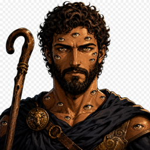

<p align="center">
  
</p>

# Laravel Agent Skills — An AI Development Team for Laravel

<p align="center">
  <a href="https://packagist.org/packages/agentic-vibes/laravel-agent-skills"></a>
  <a href="https://packagist.org/packages/agentic-vibes/laravel-agent-skills"></a>
  <a href="https://packagist.org/packages/agentic-vibes/laravel-agent-skills"></a>
  <a href="https://github.com/agentic-vibes/laravel-agent-skills/blob/master/LICENSE"></a>
  <a href="https://pekral.cz"></a>
</p>

**Laravel Agent Skills** adds an **AI development team** to your project — specialized agents that **resolve GitHub issues, open pull requests, review code, and write tests**, right inside Claude Code. One `composer require --dev` brings the whole team: five specialized subagents (`talos` implementation, `argos` code review, `athena` security, `apollon` testing, `hermes` communication) plus the complete set of `.mdc` rules and Agent skills for PHP/Laravel coding standards, testing, and conventions. The specialists are sequenced by the Claude Code harness itself (see the [`scripts/resolve-and-review.sh`](scripts/resolve-and-review.sh) pipeline template) — there is no separate orchestrator agent. The installer discovers the project root (via `composer.json` lookup from the current directory), mirrors the `rules/` directory into `.claude/rules` and the `skills/` directory into `.claude/skills`, and copies or symlinks every file into the target project.

## Why This Package

- a Composer plugin: PHP/Laravel rules + agent skills in one `composer require --dev` package
- unified PHP coding guidelines for PHP 8.4 projects
- Pest-based testing with mandatory code analysis and 100% coverage
- strong focus on clean code: typed properties, SRP, no redundant comments
- **48 comprehensive Agent skills** for automated workflows (v0.9.1)
- fast onboarding inside development repositories

## Installation

```bash
composer require agentic-vibes/laravel-agent-skills --dev
vendor/bin/agent-skills install --force
```

The installer targets **Claude Code only**:

- `.claude/rules`, `.claude/skills`, and when `HOME`/`USERPROFILE` is set also `~/.claude/skills`
- `.claude/agents` (the five subagents)
- `CLAUDE.md` in the project root

When the package is required via Composer, sources are read from `vendor/agentic-vibes/laravel-agent-skills/rules` and `vendor/agentic-vibes/laravel-agent-skills/skills`.

> [!IMPORTANT]
> By default, the installer only copies missing files and keeps existing content untouched. Use the `--force` flag to overwrite existing files: `vendor/bin/agent-skills install --force`. This is particularly useful when you want to update rules to their latest versions or when you've made local changes that should be replaced. The file `CLAUDE.md` is never overwritten once it exists in the target project, so you can safely customize it.

### Automatic Installation via Composer Plugin

By default, the Composer plugin does **not** auto-install rules on `composer install` or `composer update`. To enable automatic installation, add the following to your project's `composer.json`:

```json
{
  "extra": {
    "agent-skills": {
      "auto-install": true
    }
  }
}
```

| Option         | Description                                              | Default   |
|----------------|----------------------------------------------------------|-----------|
| `auto-install` | Enable automatic install on `composer install/update`.   | `false`   |

If you prefer manual control, simply call `vendor/bin/agent-skills install` in your Composer `post-update-cmd` scripts with the desired flags.

### Available Commands

```bash
vendor/bin/agent-skills help                                  # print help
vendor/bin/agent-skills install                                # install for Claude Code
vendor/bin/agent-skills install --force                        # overwrite existing files
vendor/bin/agent-skills install --symlink                      # prefer symlinks (fallback to copy)
vendor/bin/agent-skills install --allow-bundled-scripts         # whitelist this package's bundled scripts in ~/.claude/settings.json
```

### Installer Flow

1. Determine the project root by walking up from the current directory until `composer.json` is found.
2. Resolve the rules source (local `rules/` or `vendor/agentic-vibes/laravel-agent-skills/rules`).
3. Install rules into `.claude/rules`.
4. If present, resolve the skills source and install into `.claude/skills` (and `~/.claude/skills` when `HOME`/`USERPROFILE` is set).
5. Copy `agents/` to `.claude/agents` and `CLAUDE.md` to the project root (never overwrites existing).
6. Optionally overwrite existing files with `--force`; use `--symlink` to prefer symlinks (fallback to copy on Windows).
7. Surface explicit errors for missing directories, removal failures, and copy/symlink failures.

### CLI Switches

| Option            | Description                                                                 |
|-------------------|-----------------------------------------------------------------------------|
| `--force`                 | Overwrite files that already exist in the target directory.                                                                                                 |
| `--symlink`               | Create symlinks when the OS permits; automatically falls back to copy.                                                                                      |
| `--prune`                 | Remove files in target that no longer exist in source.                                                                                                       |
| `--allow-bundled-scripts` | Opt-in. Idempotently appends a narrow allow-list for this package's bundled scripts (`load-issue.sh` for GitHub and JIRA) to `~/.claude/settings.json`, so Claude Code stops prompting on every run. Other entries in `settings.json` are preserved. No effect when `HOME` / `USERPROFILE` is not set. |
| *(default)*               | Only copy missing files and keep existing content untouched.                                                                                                |

---

## Claude Code Subagents

Agents are a thin orchestration layer over the existing skills — they don't replace them and they don't duplicate their prompts. The roster is named after **Greek mythology** by function (see [`docs/agents.md`](docs/agents.md)).

```text
Rules  = long-lived project standards
Skills = reusable workflows
Agents = specialised orchestration roles over multiple skills
```

Each agent has its own avatar under [`assets/agents/`](assets/agents). Full role definitions live in [`docs/agents.md`](docs/agents.md).

<table>
<tr>
<td width="96" valign="top"></td>
<td valign="top">

**`argos` — code-review gatekeeper** · read-only

Reviews a PR from context or a tracker link, posts the findings back to the PR, and returns a `CR done` handoff. Owns code quality, architecture, and optimisation; security is owned by `athena`, which runs as a separate pass.

**Orchestrates:** `code-review-github`, `code-review-jira`, `code-review-bugsnag`

</td>
</tr>
<tr>
<td width="96" valign="top"></td>
<td valign="top">

**`talos` — code-writing implementer**

Implements an issue from context or a tracker link, runs local checks (`composer build`) and fixes their errors, then opens a PR. Stops at the PR — it never reviews its own work or merges.

**Orchestrates:** `resolve-issue`

</td>
</tr>
<tr>
<td width="96" valign="top"></td>
<td valign="top">

**`apollon` — test engineer**

Designs test scenarios (edge cases, regression) from the assignment, writes the PHPUnit/Pest tests, generates browser test scenarios, and verifies every acceptance criterion. Write-capable for test code only; runs on `sonnet` at the lowest effort for fast, cheap validation.

**Orchestrates:** `create-test`, `create-missing-tests-in-pr`, `e2e-testing`

</td>
</tr>
<tr>
<td width="96" valign="top"></td>
<td valign="top">

**`athena` — security analyst & CR sentinel** · read-only

Two modes: an on-demand pre-implementation security analysis (feeding a remediation plan to `talos`), and a dedicated security CR over a PR or diff. Applies every security rule and labels each finding Critical / Moderate / Minor.

**Orchestrates:** `security-review`, `laravel-security`, `security-bounty-hunter`, `security-threat-analysis`, `analyze-problem`

</td>
</tr>
<tr>
<td width="96" valign="top"></td>
<td valign="top">

**`hermes` — release announcer** · read-only

Turns a merged change or release into announcement content: a Twitter/X tweet (≤280 chars) + thread, release notes, and a marketing summary with pekral.cz promotion. Runs post-delivery and publishes only when explicitly asked.

**Orchestrates:** `resolve-issue/references/source-detection`

</td>
</tr>
</table>

### How to use `argos` in practice

1. Install for Claude Code:

   ```bash
   vendor/bin/agent-skills install
   ```

   Agents land in `.claude/agents/`.

2. Invoke it with a **source** — a GitHub PR/issue, a JIRA key, a Bugsnag error, or just the current branch/PR:

   ```text
   @argos review PR #123
   @argos review https://your.atlassian.net/browse/PROJ-42
   @argos review the current diff
   ```

3. `argos` detects the tracker, runs the matching `code-review-*` skill, lets it **post the review to the PR**, then returns a handoff: `CR done` + PR link + source link + Critical/Moderate/Minor counts + assignment-conformance verdict.

`argos` is **read-only** — it never applies fixes, commits, pushes, or merges. Those belong to separate agents.

### How to use `talos` in practice

1. Install for Claude Code, exactly as for `argos` — agents land in `.claude/agents/`.

2. Invoke it with a **source** — a GitHub issue/PR, a JIRA key, a Bugsnag error, or just the task you want implemented:

   ```text
   @talos implement #123
   @talos implement https://your.atlassian.net/browse/PROJ-42
   @talos implement the failing upload validation
   ```

3. `talos` detects the source, runs `resolve-issue` to implement the change, runs local checks (`composer build`) and fixes their errors, then opens a PR and returns a handoff: `Impl done` + PR link + source link + branch + a summary of what changed and the local-checks result.

`talos` **stops at the PR** — it never reviews its own work or merges. Code quality and architecture CR belong to `argos`; security CR belongs to `athena`. Hand the PR to `argos` (and optionally `athena`) for review next.

> [!NOTE]
> **If `talos` reports `Blocked: sandbox denied file write`:** dispatched subagents run non-interactively, so a write is denied unless the path is pre-allowed. Add scoped `Edit` / `Write` entries for the project tree to `permissions.allow` in `.claude/settings.local.json` (`"Edit(//Users/me/Projects/my-app/**)"`, `"Write(//Users/me/Projects/my-app/**)"`) — or run the installer with `--allow-subagent-writes` to add them for you — then re-run. See [`docs/agents.md`](docs/agents.md) *Troubleshooting — subagent file writes blocked*. The run correctly stops instead of silently finishing the work in the main thread.

### How to run the full pipeline

There is no orchestrator agent — the Claude Code harness sequences the specialists and the skills itself, in a fixed order. [`scripts/resolve-and-review.sh`](scripts/resolve-and-review.sh) is a template / wrapper that validates the input, detects the tracker (GitHub / JIRA / Bugsnag), and prints the exact skills to run in order (it does **not** invoke Claude — you run each printed skill in your Claude Code session):

```bash
scripts/resolve-and-review.sh "<issue-ref|text>"           # resolve → code review → process review
scripts/resolve-and-review.sh --merge "<issue-ref|text>"   # …and merge when the review converges
```

The sequence is always:

1. **`/resolve-issue <issue-ref|text>`** — implement the change and open the PR (`talos`).
2. **`/code-review-<tracker> <PR>`** — a fresh CR round on the PR (`argos` + the `athena` security pass); the wrapper picks `code-review-github` / `code-review-jira` / `code-review-bugsnag` from the source's tracker.
3. **`/process-code-review <PR>`** — resolve the findings when the CR round reported any, iterating to `0 Critical + 0 Moderate`.
4. **`/merge-github-pr <PR>`** — merge into the base branch, only when a merge was requested.

Each specialist stays a standalone role you can also invoke directly (`@argos review PR #123`, `@talos implement #123`). See [`docs/agents.md`](docs/agents.md) *End-to-end run* for the full picture.

---

## Rules Overview

Rules included in this package:

| File                          | Description                                                | Scope    |
|-------------------------------|------------------------------------------------------------|----------|
| `php/core-standards.mdc`      | Project context, AI behavior, and unified PHP/Laravel coding standards | Always   |
| `compound-engineering/general.mdc` | Compound engineering — make future work easier and read the per-project compound memory | Always   |
| `git/general.mdc`             | Unified git workflow, commits, and pull request rules       | Always   |
| `code-review/general.mdc`     | Code review conventions and output rules                   | Always   |
| `code-testing/general.mdc`    | Testing conventions and quality standards                  | Always   |
| `refactoring/general.mdc`     | Shared refactoring definition (legacy → modern, incremental migration) | Refactor |
| `jira/general.mdc`            | JIRA CLI usage and formatting rules                        | JIRA     |
| `reports/general.mdc`         | Language rule for reports published to issue trackers (assignment language) | Always   |
| `laravel/architecture.mdc`    | Laravel architecture and conventions                       | Laravel  |
| `laravel/laravel.mdc`         | Laravel-specific rules and patterns                        | Laravel  |
| `laravel/filament.mdc`        | Filament v4 specific rules                                 | Filament |
| `laravel/livewire.mdc`        | Livewire component rules and conventions                   | Livewire |
| `laravel/queue-debouncing.mdc`| Safe Laravel queue debouncing, urgency separation, and replaceable work | Laravel  |
| `laravel/dynamodb.mdc`        | DynamoDB query safety: scan prevention, key-targeted reads, Tinker debug | Laravel  |
| `sql/optimalize.mdc`          | SQL query optimization, index design, schema standards     | Always   |
| `security/backend.md`         | Backend security rules and OWASP Top 10 checks             | Always   |
| `security/frontend.md`        | Frontend security rules (XSS, CSRF, CSP)                  | Frontend |
| `security/mobile.md`          | Mobile-specific security rules and WebView checks          | Mobile   |

All `.mdc` and `.md` files are ready for automatic injection by Claude Code so every PHP and Laravel edit stays aligned with the enforced standards.

## Development & Testing

### Composer Scripts

```bash
composer check              # run full quality check (skill-check, normalize, phpcs, pint, rector, phpstan, audit, tests)
composer fix                # run all automatic fixes (skill-check-fix, normalize, rector, pint, phpcs)
composer build              # install (agent-skills install --force) then fix then check
composer analyse            # run PHPStan static analysis
composer test:coverage      # run tests with 100% coverage
composer coverage           # alias for test:coverage
composer security-audit     # run security audit of dependencies
```

### Individual Commands

```bash
composer skill-check                # SKILL.md linter (validation + scoring across every skill)
composer skill-check-fix            # SKILL.md linter with auto-fix
composer composer-normalize-check   # validate composer.json normalization (dry-run)
composer composer-normalize-fix     # apply composer.json normalization
composer phpcs-check                # PHP CodeSniffer check
composer phpcs-fix                  # PHP CodeSniffer fix
composer pint-check                 # Laravel Pint check
composer pint-fix                   # Laravel Pint fix
composer rector-check               # Rector check (dry-run)
composer rector-fix                 # Rector fix
```

### Testing

```bash
./vendor/bin/pest           # run all tests
composer test:coverage      # run tests with coverage (min. 100%)
```

Remove `coverage.xml` before committing if it was produced locally.

## Author

**Petr Král** — PHP Developer & Laravel programmer, open source contributor ([pekral.cz](https://pekral.cz)).
